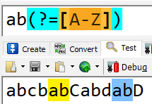
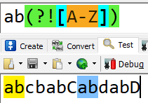

# 零宽断言

## what:

​	零宽断言是是零宽度的匹配, 它匹配到的内容不会保存到匹配结果中,最终匹配结果是一个位置,就像字符边界一样

## when:

​	使用正则想到捕获的内容前后是特定的内容, 但是又不捕获这些内容,  相当于一个条件表达式.

## how:

​	指定位置添加一个限定条件, 用来规定必须满足条件正则才能匹配成功

```regular expresion
.满足限定条件的正则表达式才能匹配成功
正则表达式(?=限定条件)
.满足取反限定条件的正则表达式才能匹配成功
正则表达式(?!限定条件)
```

比如:ab后跟的是大写字母

```
ab(?=[A-Z])
```



ab后跟的不是大写字母

```
ab(?![A-Z])
```



## example:

### 一.千分符 (货币单位每三位有个, like123,232,232.12 和123,232,233)

1.匹配结尾是$或者是.

```
.是匹配所有, 要使用转义符
(\.|$)
```

2.零宽断言, 数字到末尾或者点是三个数字

```
\d(?=\d{3}(\.|$))
```

3.可以有多个三位数字

```
\d(?(\d{3})+(\.|$))
```

4.结合js, 把找到的数字替换为数字, 在replace函数中的"$1"代表正则表达式第一个括号中的匹配到的字符

```
str = str.replace(/(\d)(?(\d{3})+(\.|$))/g, "$1,")
```

### 二.简单的密码强度(长度至少为六,至少一个大写字母,至少一个数字, 不能有除_以外的特殊符号 )

反向思考

1. 至少包含一个大写母:

​	a) 从开头到结尾不能全部是小写或者数字或者_

​	b)说明至少包含大写字母或者其他特殊字符

```
^(?![0-9a-z_]+$)
```

2. 至少包含一个数字:

​	a) 从开头到结尾不能全部是字母或者_

​	b)说明至少包含数字或者其他特殊字符

```
^(?![a-zA-Z_]+$)
```

3. 正则密码为字母和数字_的组合\w, 六位以上

```
^\w{6,}$
```

4. 集合条件

```
^(?![0-9a-z_]+$)(?![a-zA-Z_]+$)\w{6,}$
```


